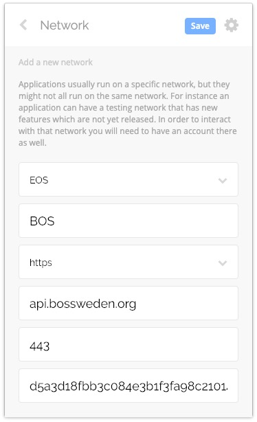
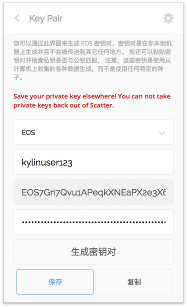
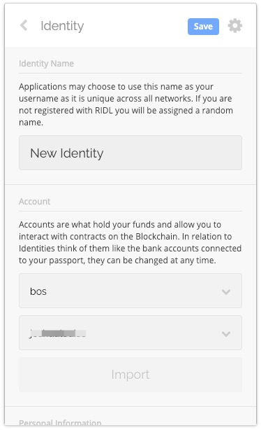
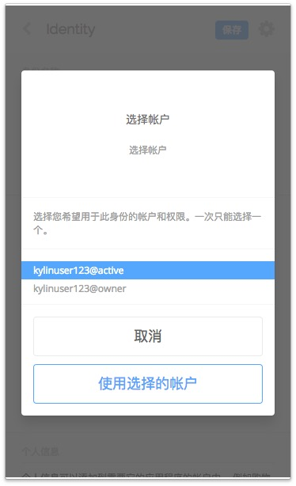

# 使用scatter在BOS链发起交易

## 配置scatter

### 1. 设置网络
打开scatter-设置（右上角的logo）-网络，点击新建，输入下面的配置，点击保存.
```
api.bossweden.org
EOS https 443
Chain ID:d5a3d18fbb3c084e3b1f3fa98c21014b5f3db536cc15d08f9f6479517c6a3d86
```


### 2. 设置密钥对

打开 scatter - 密钥对 - 新建 , 输入账户名备注和私钥，保存。
   


### 3. 添加身份

打开 scatter - 身份 - 新建 ， 选择网络和秘钥对，点击导入，选择导入的权限，建议使用active，点击保存。

 

## 发送交易

现在可以在 https://bos.eosx.io 中利用scatter签名发起各种交易，后续在测试网中测试的dapp也可以使用scatter接入。

